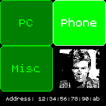

# MAC Giver

Give your Bangle.js a new MAC address. Sometimes it is bothersome to connect the BangleJS to different devices. This app should help you to make the connection easier. Instead of 'forgetting' the device and reconnecting, you can change the MAC address of the BangleJS and let only your PC or your phone know about that particular address.

## Usage

Tap on one of the three buttons to change the MAC address. The Phone mac address is the default one.

## Screenshots

## Creator

devsnd
